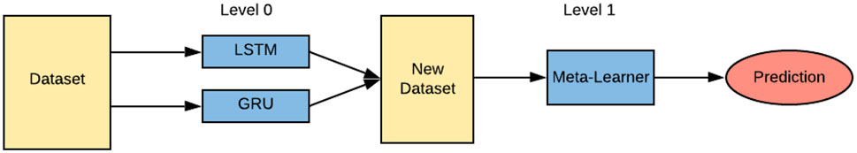

# 《深度学习模型与应用》个人作业三 第二题 对上证收盘价进行建模和预测

## 项目说明

本项目旨在完成《深度学习模型与应用》个人作业三 中的第二一题“对上证收盘价进行建模和预测”。

- **数据预处理**：笔者使用pandas和sklearn这两个包来对数据进行预处理和Dataloader构建，以符合pytorch的输入要求，最终形成两个训练集、验证集和测试集。
- **框架和模型选择**：笔者使用pytorch框架，选用LSTM模型和GRU模型作为子模型进行模型搭建和训练，选用三层全连接的前馈神经网络作为元学习器。主题思路是将两个RNN模型变体组合起来，集成学习。实现从序列（时间滑动窗口）到序列（预测时间的长度）
- **超参数调整**：笔者使用optuna，以最小化均方误差为目标，制定好包括批次处理大小，隐藏层数，隐藏层维度，学习率，滑动窗口长度这几个超参数的搜索空间，在模型上进行超参数调整。

## 项目结构

```text
SSEClosePricePredictor2024
├── data_preprocessing.py                           # 脚本用于预处理数据和Dataloader构建
├── engine.py                                       # 引擎脚本，负责模型的训练，调参和评估流程
├── main.py                                         # 主脚本，项目的入口点
├── model.py                                        # 包含预测模型定义的脚本
├── ModelTrainingLifecycle                          # 记录模型训练生命周期的日志
├── Model_Architecture.png                          # 模型架构图
├── README.md                                       # 项目的README文件，描述项目信息和启动指南
├── data                                            # 数据目录，存放项目数据文件
│   └── 上证指数走势-历史数据-已更新至20240430.csv     # 上证指数数据集
└── trained_models                                  # 训练模型目录，存放训练后的模型文件
    ├── best_sub_GRUModel.pth                       # 训练后的GRU模型权重文件
    ├── best_sub_LSTMModel.pth                      # 训练后的LSTM模型权重文件
    ├── best_MetaModel.pth                          # 训练后的元学习器模型权重文件
    └── best_model_params.json                      # 训练后的模型超参数文件
```

## 运行说明

在安装好相关依赖后，进入`SSEClosePricePredictor2024`目录，直接运行 `main.py`脚本即可

## 模型介绍

模型架构如下：


本模型采用双层次结构。首先，笔者使用训练数据集1训练第一个子模型：LSTM模型。该LSTM模型包含若干层，每层有若干个神经元，并且每个隐藏层增加了0.2的dropout。通过100个周期的训练后，将训练数据集2输入LSTM进行首次预测，得到的结果称为LSTM预测。其次，笔者训练第二个子模型：GRU模型。架构和LSTM相同。训练完毕后，将训练数据集2输入GRU进行预测，得到GRU预测。得到LSTM和GRU的预测后，将这些预测数据以p×m的形式（p代表预测数量，m代表模型数量）组合成新的训练数据集，用于训练第二级的元学习器。元学习器是一个包含三层的全连接神经网络，激活函数采用ReLU。元学习器训练完成后，将使用验证集来再次输入到子模型中生成中间验证数据，随后元学习器使用这些中间验证数据的预测结果来做出最终的验证预测。使用这个验证集来进行超参数调整，以此得到最终的模型。再使用相同的方式使用测试集得到最终的预测结果。这种两级模型结构有效整合了不同子模型的特点，通过元学习器优化和提升预测的准确性。

本模型参考[Li, Y., Pan, Y. A novel ensemble deep learning model for stock prediction based on stock prices and news. Int J Data Sci Anal 13, 139–149 (2022).](https://doi.org/10.1007/s41060-021-00279-9)

## 结果评价

笔者使用optuna，以最小化均方误差为目标，制定好包括批次处理大小，隐藏层数，隐藏层维度，学习率，滑动窗口长度这几个超参数的搜索空间，在LSTM和GRU这两个模型上进行超参数调整。

定义的参数网络为：

```python
batch_size = trial.suggest_categorical("batch_size", [16, 32, 64, 128])
num_layers = trial.suggest_int("num_layers", 2, 4)
hidden_dim = trial.suggest_categorical("hidden_dim", [32, 64, 128, 256])
meta_hidden_dim1 = trial.suggest_categorical("meta_hidden_dim1", [32, 64, 128, 256])
meta_hidden_dim2 = trial.suggest_categorical("meta_hidden_dim2", [32, 64, 128, 256])
lr = trial.suggest_float("lr", 1e-4, 1e-2, log=True)
tw = trial.suggest_categorical("tw", [20, 30, 40])
```

每个模型训练50个轮次，在500中参数组合中，找到的最优模型参数为：

```json
{
    "batch_size": 16,
    "num_layers": 3,
    "hidden_dim": 256,
    "meta_hidden_dim1": 32,
    "meta_hidden_dim2": 32,
    "lr": 0.0005767310603627514,
    "tw": 20
}
```

最终的预测结果为

```csv
tdays,SSE_index
20240506,3113.07
20240507,3102.36
20240508,3037.35
20240509,3144.58
20240510,3145.23
```

(注意：完整的训练过程和结果可见ModelTrainingLifecycle.log)

## 参考文献

[Li, Y., Pan, Y. A novel ensemble deep learning model for stock prediction based on stock prices and news. Int J Data Sci Anal 13, 139–149 (2022).](https://doi.org/10.1007/s41060-021-00279-9)
